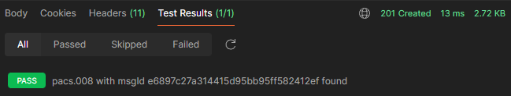
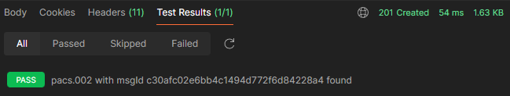
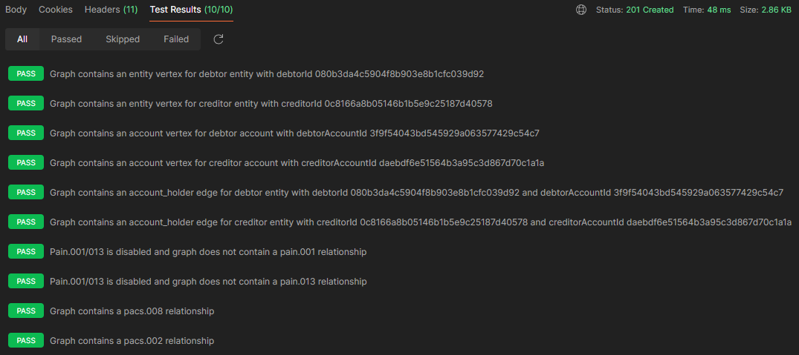
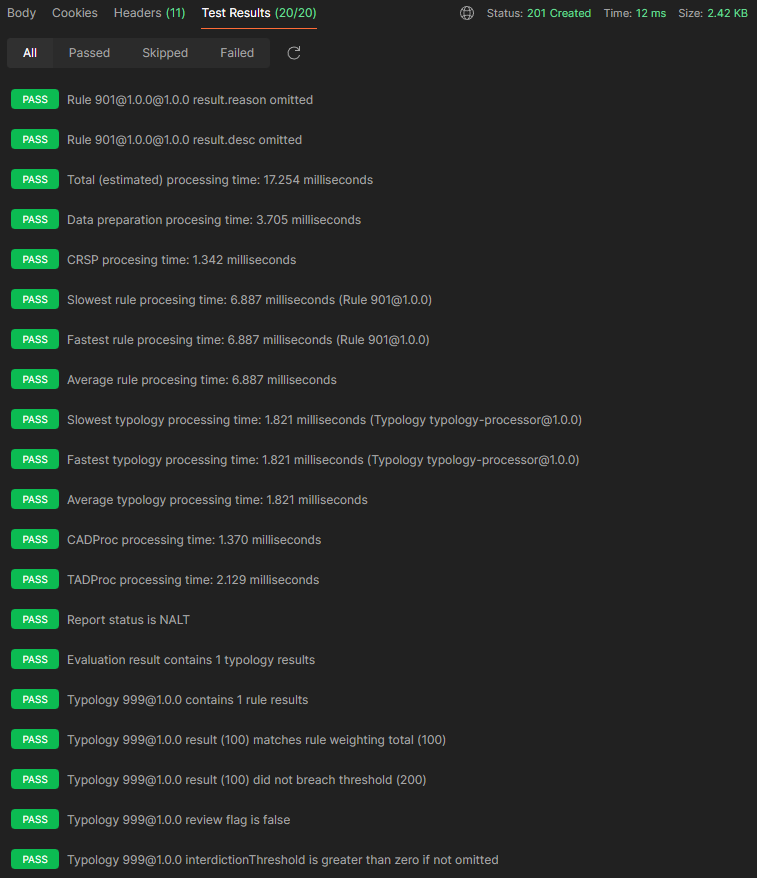
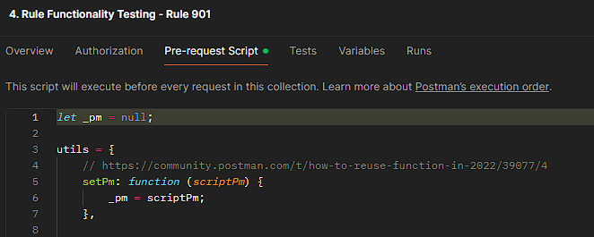

<!-- SPDX-License-Identifier: Apache-2.0 -->

## Introduction

Tazama is prefaced with the Transaction Monitoring Service (TMS) API which makes [Postman](https://www.postman.com/) a useful tool to test platform functionality. In days gone by, Tazama was also composed out of a series of forward-chaining microservices that all had their own RESTful interfaces to receive incoming requests, but we have since replaced our inter-services communication protocol with [NATS](http://nats.io) that connects all our internal processors via its pub/sub interface. While we still use Postman to test the internal processors, we now have to access the NATS pub/sub interface via a NATS REST Proxy that we also built. (You can read more about the NATS REST proxy in the [nats-utilities](https://github.com/tazama-lf/nats-utilities/tree/main)) repository.

The files and folders you see here can be used to test Tazama via both the TMS API and, as an example, rule processor 901, our sample template rule processor.

When you are deploying Tazama as a public user<sup>1</sup> you will be able to use the tests here to validate your deployment. The instructions to set up Tazama via Docker Compose into a Full Stack containerized implementation can be found in the [Full-Stack-Docker-Tazama](https://github.com/tazamma-lf/Full-Stack-Docker-Tazama/tree/main) repository. The instructions there will provide specific guidance on how to test a deployment using the end-to-end test above.

If you are setting up your environment according to the instructions in the [Tazama Contribution Guide](https://github.com/tazama-lf/docs/blob/main/Community/Tazama-Contribution-Guide.md#32-setting-up-the-development-environment), those instructions will also guide you on how to use these Postman tests to test our sample rule processor 901 in isolation using the NATS REST proxy.

To use any of these tests, you can clone this repository onto your local machine and either import the tests you want to run or work on into Postman, or you can run the tests from a command line via [Newman](https://learning.postman.com/docs/collections/using-newman-cli/installing-running-newman/#installing-newman).

Read on for some more information on the tests, and also guidance on how to write tests for your own processors.

## The folders

### archived-legacy-tests

Our use of Postman has evolved over the years. We are always finding new and better ways of using Postman for our testing. We are also hoarders, and we don't like to throw anything away. This folder contains tests that no longer work for testing Tazama, but the tests may contain some scripts that may again prove to be useful in the future. Browse at your leisure, or your peril.

### environments

If you're familiar with Postman then you will know that Postman tests are often executed within a specific environment configuration. Any environment variables that we use in our tests are defined in a number of environment files. The environment folder contains two environment files that we use for different purposes. If you are deploying Tazama into your own cloud environment, and you would like to create a Postman environment file that matches your deployed environment, you can modify either of these environment files for your needs.

> [!NOTE]
> 
> Postman contains two kinds of variables: there are environment variables and global variables. When you click the little icon in the top right in Postman, you'll get to see both types in two separate tables.
>
>As a rule in Tazama, the environment variables are just that: variables that define the parameters for running the Postman tests in a specific deployed environment. These variables should be static and persistent between tests. No Tazama Postman test (pre-request script or test) should ever use the `pm.environment.set()` method.
>
> The global variables are the ones that should be used when you are stashing values between tests. For example, if you want to set up the address to the API, it's an environment variable. If you want to remember an ID from one test to use as input into another test, it's a global variable.

#### Tazama-Docker-Compose-LOCAL.postman_environment.json

This environment will facilitate testing over the containerized Tazama that is deployed from the [Full-Stack-Docker-Tazama](https://github.com/frmscoe/Full-Stack-Docker-Tazama) repository. The environment is set up based on the default settings of the deployment.

#### Tazama-LOCAL.postman_environment.json

This environment will facilitate testing on a local installation of Tazama, mostly to support development and functional testing of a single processor at a time.

#### Tazama environment file contents

A functioning Tazama environment file for Postman will contain the following attributes. These attributes are used in our tests and allow us to make changes to the values via the environment file, instead of having to edit the scripts directly.

**General attributes:**

| Attribute(s) | Description | Example(s)
|:---:|---|---|
| `ofUrl` | The URL of the TMS API - deprecated | This variable is in the process of being retired. Going forward, use the `tazamaTMSUrl` variable |
| `tazamaTMSUrl` | The URL of the Tazama TMS API - this variable is in the process of being retired. Going forward, use the tazamaTMSUrl variable| localhost:5000 </br> https://tazama-tms.yourcompany.com |
| `tazamaAdminUrl` | The URL of the Tazama Administrative API | localhost:5100 </br> https://tazama-admin.yourcompany.com |
| `tazamaAuthUrl` | The URL of the Tazama Authentication Service API | localhost:5020 </br> https://tazama-auth.yourcompany.com |
| `natsUrl` | The URL of the NATS REST proxy for testing a specific processor directly. | localhost:3000 </br> https://tazama-tms.yourcompany.com:3000 |
| `arangoUrl` | The URL of the deployed instance of ArangoDB | localhost:18529 </br> https://tazama-arangodb.yourcompany.com:3000 |
| `keycloakUrl` | The URL of the deployed instance of KeyCloak | localhost:8080 </br> https://tazama-keycloak.yourcompany.com:8080 |
| `arangoUsername` | The ArangoDB username for retrieving an Arango token to interact with ArangoDB via its native API | This value will depend on the implementation of Arango. Typically this value is blank for local deployments. |
| `arangoPassword` | The password associated with the ArangoDB username for retrieving an Arango token to interact with ArangoDB via its native API | This value will depend on the implementation of Arango. Typically this value is blank for local deployments. |
| `activePain001` | This attribute reflects whether the platform has been configured to include or exclude a quoting phase via pain.001 and pain.013 messages as part of a transaction set | `true` - quoting is included</br> `false` - quoting is excluded |
| `path-api-version` | The API path element for the current version of the API. Do not update this value unless the API version in your deployment is different. | `/v1` |
| `path-pain001` | The API path to receive a pain.001 request. Do not update this value unless the paths in your deployment are different. | `evaluate/iso20022/pain.001.001.11` |
| `path-pain013` | The API path to receive a pain.013 request. Do not update this value unless the paths in your deployment are different. | `evaluate/iso20022/pain.013.001.09` |
| `path-pacs008` | The API path to receive a pacs.008 request. Do not update this value unless the paths in your deployment are different. | `evaluate/iso20022/pacs.008.001.10` |
| `path-pacs002` | The API path to receive a pacs.002 request. Do not update this value unless the paths in your deployment are different. | `evaluate/iso20022/pacs.002.001.12` |
| `path-entity-condition` | The API path to receive a request to manage conditions for an entity. Do not update this value unless the paths in your deployment are different. | `admin/event-flow-control/entity` |
| `path-account-condition` | The API path to receive a request to manage conditions for an account. Do not update this value unless the paths in your deployment are different. | `admin/event-flow-control/account` |

**NATS REST proxy-specific attributes:**

The attributes below are only required if you are interacting with a specific processor directly via the NATS REST proxy. The variables here are a hangover from when the processors were invoked directly through their native RESTful APIs. With the update to NATS, the internal processors can only be accessed directly via the NATS REST proxy, and for that reason the folder path must be "natsPublish".

| Attribute(s) | Description | Example(s)
|:---:|---|---|
| `path-event-director` | The folder path to the Channel Router & Setup Processor | natsPublish - no processors behind the TMS APR are REST-accessible; internal processors can only be accessed directly through the [NATS Utilities](https://github.com/frmscoe/nats-utilities) |
| `path-rule-001-rel-1-0-0` </br> to </br> `path-rule-901-rel-1-0-0` | The folder/path to the specific rule processor | natsPublish |
| `path-typology-processor` | The folder/path to the typology processor | natsPublish |
| `path-tadproc` | The folder/path to the Transaction Aggregation & Decisioning processor | natsPublish |
| `path-cms-service` | The folder/path to the Case Management egress service via NATS. This value should not be changed unless your deployment has an alternative destination configured for the CMS service. | `off-cms-service` |

**ArangoDB-specific attributes:**

The attributes below host a variety of ArangoDB variables for database and collection names to provide some abstraction in the code.In general, these values only need to change if the underlying database structure changes.

| Attribute(s) | Description | Example(s)
|:---:|---|---|
| `db_messagehistory` | The database name where the transaction history is stored | `transactionHistory` |
| `db_historygraph` | The database name where the transaction history graph data is stored | `pseudonyms` |
| `db_results` | The database name where the transaction evaluation results is stored | `evaluationResults` |
| `db_coll_msg_transactionHistoryPain001` | The collection name where the pain.001 transaction history is stored in the message history database | `transactionHistoryPain001` |
| `db_coll_msg_transactionHistoryPain013` | The collection name where the pain.013 transaction history is stored in the message history database | `transactionHistoryPain013` |
| `db_coll_msg_transactionHistoryPacs008` | The collection name where the pacs.008 transaction history is stored in the message history database | `transactionHistoryPacs008` |
| `db_coll_msg_transactionHistoryPacs002` | The collection name where the pacs.002 transaction history is stored in the message history database | `transactionHistoryPacs002` |
| `db_coll_graph_entities` | The collection name where the debtor and creditor information in a transaction is stored in the transaction history graph database | `entities` |
| `db_coll_graph_account_holders` | The edge collection name where the debtor and creditor account relationship information is stored in the transaction history graph database | `account_holder` |
| `db_coll_graph_accounts` | The collection name where the debtor and creditor account information in a transaction is stored in the transaction history graph database | `accounts` |
| `db_coll_graph_transactions` | The collection name where the debtor and creditor information in a transaction is stored in the transaction history graph database | `transactionRelationship` |
| `db_coll_graph_conditions` | The collection name where the condition information that governs transation blocking resides | `conditions` |
| `db_coll_graph_governed_as_debtor_by` | The collection name where the condition information that governs transation blocking by debtors resides | `governed_as_debtor_by` |
| `db_coll_graph_governed_as_debtor_account_by` | The collection name where the condition information that governs transation blocking by debtor accounts resides | `governed_as_debtor_account_by` |
| `db_coll_graph_governed_as_creditor_by` | The collection name where the condition information that governs transation blocking by creditors resides | `governed_as_creditor_by` |
| `db_coll_graph_governed_as_creditor_account_by` | The collection name where the condition information that governs transation blocking by creditor accounts resides | `governed_as_creditor_account_by` |
| `db_config_all` | The database name where processor configuration data is stored | `configuration` |
| `db_config_route` | The database name where routing configuration data is stored | `networkmapConfiguration` |
| `db_config_rules` | The collection name where the rule configurations will be stored in the processor configuration database | `ruleConfiguration` |
| `db_config_typologies` | The collection name where the typology configurations will be stored in the processor configuration database | `typologyConfiguration` |

**Postman testing-specific attributes:**

These attributes have an impact on how Postman tests are interpreted for testing purposes.

| Attribute(s) | Description | Example(s)
|:---:|---|---|
| `preconfigured` | This attribute is used to determine of tests of rule processors directly require that the rule configuration is to be loaded as part of the test (almost like a kind of pseudo-mocking on a rule-by-rule test basis), or if the rule configuration already exists in the database. | `true` - read the rule config from the database </br> `false` - recreate the rule config in the database before it is read |

## The files

### 1.1. (NO-AUTH) Rule-901 End-to-End test - pain001-013 disabled.postman_collection.json, and
### 1.2. (AUTH) Rule-901 End-to-End test - pain001-013 disabled.postman_collection.json, and
### 1.3. (NO-AUTH-DEMO) Rule-901 End-to-End test - pain001-013 disabled.postman_collection.json
### 1.4. (NO-AUTH-RELAY) Rule-901 End-to-End test - pain001-013 disabled.postman_collection.json
### 2. Full-service-test.postman_collection.json

These test collection contains a collection of API requests that set up a randomly generated set of pacs.008 and pacs.002 transactions, then submits the transaction pair to the TMS API, and finally performs a number of tests to make sure that the databases were properly updated and the transaction evaluated successfully to the point where a result was posted to the results database.

The Postman repository contains three different versions of this test collection:
 - 1.1. (NO-AUTH)... does not require the deployment of the API authentication components
    This test is to be used for a basic public deployment of Tazama where no KeyCloak authentication services are deployed.
 - 1.2. (AUTH)... does rely on the deployment of the API authentication component
    This test is to be used for a basic public deployment of Tazama where KeyCloak authentication services are deployed.
 - 1.3. (NO-AUTH-DEMO) Rule-901 End-to-End test - pain001-013 disabled.postman_collection.json
    This test is to be used for a basic public deployment of Tazama where the Tazama Demo UI is deployed. The demo does not currently cater for authentication services, and also does not cater for List Management which is now deployed by default in a public deployment and when the demo UI is deployed, these components should not be deployed.
 - 1.4. (NO-AUTH-RELAY) Rule-901 End-to-End test - pain001-013 disabled.postman_collection.json
    This test is to be used for a basic public deployment of Tazama where the relay services that will handle interdiction and egress to a case management system will be deployed. The test utilises the NATS REST Proxy to collect outgoing messages routed, via the `interdiction-service` and `cms` NATS subjects, from the `tazama-egress` NATS subject.
 - 2. Full-service-test.postman_collection.json
    This test is to be used for a "full-service" deployment of Tazama that will contain all the rules available on the `tazamaorg` DockerHub repository. This test will validate the installation of the Tazama full-service Docker stack.

Tazama has created a Javascript utility library to assist with the creation of valid pain.001, pain.013, pacs.008 and pacs.002 messages, one-by-one or in bulk. You can find the documentation for this utility further down in this page, or you can view the docstrings for each of the functions in the code in the test collection's Pre-Request Script tab.

The paragraphs below will provide a brief overview of each of the requests and tests in this test collection.

**Folder: Message creation sans pain.001/013**

 - Create messages in memory

    This request uses the Javascript utility library to create a pacs.008 message and a pacs.002 message. The messages in the set are linked via a common `EndToEndId` identifier.

    The complete messages, along with some specific attributes that we will be using in later requests, are stashed as global variables in Postman. You can also view the created information in the console when the request is executed.
    
    The default behaviour of the platform is to exclude the quoting steps via the `activePain001` environment variable and no pain.001/013 message will be created in this test.

    The message creation request is set up as a Postman test using a GET method and simultaneously checks that the TMS API is available. The TMS API will respond with: 
    ```json
    {
      "status": "UP"
    }
    ```

 - Post pacs.008 to TMS API - unauthenticated

    The pacs.008 message is sent to the TMS API. The TMS API validates the incoming message and updates the database with the pacs.008 data. If the database update is successful, the message is routed to the Event Director and a response is generated by the API confirming that the message was successfully received. This response is not the result of the evaluation though, but only the successful receipt and ingestion of the message. The platform still has to do all the work to evaluate the message and the evaluation result will be posted to the results database once the evaluation is complete. The TMS API should respond with:

    ```json
    {
      "message": "Transaction is valid",
      "data": {
        "TxTp": "pacs.008.001.10",
        <a copy of the incoming message>
    }
    ```
    This test will POST a message to the API without authentication. If this test is sumitted out of the 1.2. (NO_AUTH)... collection, then the response will be:
    ```json
    {
      "error": "Unauthorized"
    }
    ```

 - Post pacs.002 to TMS API - unauthenticated

    The pacs.002 message is sent to the TMS API. The TMS API validates the incoming message and updates the database with the pacs.008 data. If the database update is successful, the message is routed to the Event Director and a response is generated by the API confirming that the message was successfully received. This response is not the result of the evaluation though, but only the successful receipt and ingestion of the message. The platform still has to do all the work to evaluate the message and the evaluation result will be posted to the results database once the evaluation is complete. The TMS API should respond with:

    ```json
    {
      "message": "Transaction is valid",
      "data": {
        "TxTp": "pacs.002.001.12",
        <a copy of the incoming message>
    }
    ```
    This test will POST a message to the API without authentication. If this test is sumitted out of the 1.2. (NO_AUTH)... collection, then the response will be:
    ```json
    {
      "error": "Unauthorized"
    }
    ```

The 1.2 (AUTH) collection contains additional tests in the collection:

 - Fetch Access Token

    A username and password is sent to KeyCloak to retrieve a JWT access token that can be used to access the API securely. The request should respond with the token and the response should contain the following attributes:
    ```json
    {
      "access_token": "<access_token_redacted>",
      "expires_in": 60,
      "refresh_expires_in": 1800,
      "refresh_token": "<bearer_token_redacted>",
      "token_type": "Bearer",
      "not-before-policy": 0,
      "session_state": "132b7181-cac4-4f3a-af78-63ddfe4d6371",
      "scope": "profile email"
    }
    ```

 - Fetch Authorization Token

    A username and password is sent to the authentication service API to retrieve a JWT that can be used to access the API securely. The request should respond with the token:
    ```json
      authentication_token_redacted
    ```

 - Post pacs.008 to TMS API - Authenticated

    The pacs.008 message is sent to the TMS API using the JWT token previously acquired. The TMS API validates the incoming message and updates the database with the pacs.008 data. If the database update is successful, the message is routed to the Event Director and a response is generated by the API confirming that the message was successfully received. This response is not the result of the evaluation though, but only the successful receipt and ingestion of the message. The platform still has to do all the work to evaluate the message and the evaluation result will be posted to the results database once the evaluation is complete. The TMS API should respond with:

    ```json
    {
      "message": "Transaction is valid",
      "data": {
        "TxTp": "pacs.008.001.10",
        <a copy of the incoming message>
    }
    ```

 - Post pacs.002 to TMS API - Authenticated

    The pacs.002 message is sent to the TMS API using the JWT token previous acquired. The TMS API validates the incoming message and updates the database with the pacs.008 data. If the database update is successful, the message is routed to the Event Director and a response is generated by the API confirming that the message was successfully received. This response is not the result of the evaluation though, but only the successful receipt and ingestion of the message. The platform still has to do all the work to evaluate the message and the evaluation result will be posted to the results database once the evaluation is complete. The TMS API should respond with:

    ```json
    {
      "message": "Transaction is valid",
      "data": {
        "TxTp": "pacs.002.001.12",
        <a copy of the incoming message>
    }
    ```

**Folder: DB update tests**

The tests in this folder interrogates the database to make sure that the datebases and collections were correctly updated when the message was received and that the transaction evaluation completed successfully.

 - Get Arango Token

    If your installation of Arango is secured with a username and password, this request will use the ArangoDB credentials from the environment file to fetch a short-term security token from Arango that you need to access the ArangoDB API for the queries below.

 - Fetch created pacs.008 from transactionHistoryPacs008

    This request checks if the pacs.008 message we had submitted was successfully written to the `transactionHistoryPacs008` collection in the `transactionHistory` database. The request attempts to retrieve the pacs.008 message via the `msgId` that we had used when we created the messages in memory. The response body will contain the retrieved message and the Test Results tab should show the successful result of the test assertion:

    

 - Fetch created pacs.002 from transactionHistoryPacs002

    This request checks if the pacs.002 message we had submitted was successfully written to the `transactionHistoryPacs002` collection in the `transactionHistory` database. The request attempts to retrieve the pacs.002 message via the `msgId` that we had used when we created the messages in memory. The response body will contain the retrieved message and the Test Results tab should show the successful result of the test assertion:

    

 - Check graph creation

    This request checks if al the graph database components of the incoming message were properly created in the `pseudonyms` database. The request attempts to retrieve the individual graph nodes and vertices from the database via the identifiers that we had used when we created the messages in memory. The response body will contain the retrieved components and the Test Results tab should show the successful result of the test assertions:

    

 - Fetch evaluation results with msgId - Rule 901 Network Map Only

    This final test checks that the evaluation result was successfully produced by the system and safely stored in the `transactions` collection in the `evaluationResults` database. The response body will contain the retrieved evaluation result and the Test Results tab should show the successful result of the test assertions:

    

### Creating messages in Memory

At the start of this test collection, we create a new and unique set of messages in memory (as stashed global variables), so that the messages can be sent into the platform via the TMS API one by one. These messages are created and stashed through a function in the `utils` library in the root test collection folder.

#### Linking the utility library

To be able to easily use re-usable functions in Postman such as the ones in the utility library, we have to let the utility library know which Postman environment the utility functions are aimed at. To achieve this, we pass the Postman `pm` object to the utility library as the first step in the test's Pre-request Script with the following statement:

```js
utils.setPm(pm);
```

The utility library maps the Postman `pm` object to an internal `_pm` object to allow the utility library to interact with the test's `pm` object. If this statement is missing, the test will fail with an error message such as:

```
There was an error in evaluating the Pre-request Script:TypeError: Cannot read properties of null (reading 'environment')
```

#### Clearing previously created messages

The next set of instructions are aimed resetting the data perhaps already in memory, just to make sure that we don't produce any unexpected results:

```js
pm.globals.unset("dataCache");
pm.globals.unset("endToEndId");
pm.globals.unset("messageIdPain001");
pm.globals.unset("messageIdPain013");
pm.globals.unset("messageIdPacs008");
pm.globals.unset("messageIdPacs002");
pm.globals.unset("pain001");
pm.globals.unset("pain013");
pm.globals.unset("pacs008");
pm.globals.unset("pacs002");
```

The statements above will clear specific global variables, but you can also clear all global variables with the follwing instruction:

```js
pm.globals.clear();
```

#### Creating a new message set in memory

The primary purpose of the `utils` function is to help testers to create valid incoming ISO20022 message sets to help facilitate the tests they are trying to perform.

Unfortunately Postman will not render a function's DocString in the test's Pre-Request Script tab, and you'll have to view the function in the `utils` library directly. To view the `utils` library, you have to open the Pre-Request Script for the root test collection folder:



You can browse or search the utils library to find the DocString for any function:

```js
/**
 * Converts a time unit to its equivalent in milliseconds.
 * 
 * Example: `weekInMilliseconds = 7 * utils.timeframe('d');`
 *
 * @param {string} unit - The time unit to convert. Supported units are 'd'/'days', 'h'/'hours', 'm'/'minutes', and 's'/'seconds'.
 * @returns {number} The number of milliseconds corresponding to the given time unit.
 */

timeframe: function (unit) {...}
```

The `utils` library contains a number of different functions to create test messages. One of these functions is the `createTransactionSetInMemory()` function, which can be invoked simply as follows:

```js
createdMessageSet = utils.createNewTransactionSetInMemory();
```

This function will create a new transaction set containing pain.001, pain.013, pacs.008 and pacs.002 messages linked via a new and unique common `EndToEndId` identifier. The debtor, creditor and debtor and creditor account identifiers will also be newly generated and unique. The transaction set will contain a randomly generated amount for the "XTS" test currency between 10 and 1000. The remaining "deterministic" values of the ISO20022 messages will be defaulted to specific values.

The result of the message creation is stashed in a variety of Postman global variables, for later retrieval, but is also returned from the utility function as an object and the individual created messages can be accessed as follows:

```js
createPacs008 = createdMessageSet.pacs008;
createPacs002 = createdMessageSet.pacs002;
```

> [!NOTE]
>
> The pain.001 and pain.013 messages will only be created if the Postman environment variable `activepain001` is set to `true`.

Another way of writing the `createTransactionSetInMemory()` function is a little more verbose, but perhaps also a bit more understandable and descriptive:

```js
createdMessageSet = utils.createTransactionSetInMemory(
    /* Quoting Enabled - null defaults false ------------------------ */ null,
    /* Timestamp Offset - null defaults 0 --------------------------- */ null,
    /* Timestamp Interval - null defaults 300000 -------------------- */ null,
    /* Debtor ID - null defaults random UUID ------------------------ */ null,
    /* Debtor Account ID - null defaults random UUID ---------------- */ null,
    /* Creditor ID - null defaults random UUID ---------------------- */ null,
    /* Creditor Account ID - null defaults random UUID -------------- */ null,
    /* Instructed Currency - null defaults to 'XTS' ----------------- */ null,
    /* Instructed Amount - null defaults to random amount ----------- */ null,
    /* Settlement Currency - null defaults to Instructed Currency --- */ null,
    /* Settlement Amount - null defaults to Instructed Amount ------- */ null,
    /* Exchange Rate Currency - null defaults to Instructed Currency  */ null,
    /* Exchange Rate - null defaults to 1.0 ------------------------- */ null,
    /* Description - null defaults random UUID ---------------------- */ null,
    /* Status - null defaults 'ACCC' (successful) ------------------- */ null,
    /* Debtor Age - null defaults 25 -------------------------------- */ null,
    /* Transaction Type - null defaults 'MP2P' ---------------------- */ null,
    /* Latitude - null defaults -3.1609 ----------------------------- */ null,
    /* Longitude - null defaults 38.3588 ---------------------------- */ null
    );
);
```

This templated layout allows you to easily update a specific attribute in the set creation process to test the impact of changing that single attribute of a message on the system's behaviour. Most of the values are self-explanatory, but some are worth calling out.

 - **The Time-Stamp Epoch**: The time-stamp epoch defines a specific time before `now()` when you want the final message in the set (i.e. pacs.002) to appear to be created. The value here is provided in milliseconds and will modify the function's default time-stamp for the final message in the set to be further in the past by that number of milliseconds. The function then distributes the remaining messages evenly with one message time-stamp set "Timestamp Interval" milliseconds (default 300000 - 5 minutes) before the other. In other words, if you pass an epoch parameter of 300000 (5 minutes), your transactions will be distributed on a time-stamp timeline as follows:

    

 - **Debtor Age**: The ISO20022 message contains a Date of Birth value for the debtor, but for testing purposes it is often the age of the debtor that matters. The function will accept an age and then calculate an appropriate date of birth from the age value. The age is converted into a number of days (366 days per year) and the date of birth is calculated as now() less the number of days. The age can be provided as a fraction of a year as well, e.g. `25.4`.

 - **Transaction Type**: The default value here will depend on whether pain.001/013 messages are enabled via the `activePain001` environment variable. The pain.001 message currently contains a different list of values for the purpose or type of transaction than the pacs.008 message. If the pain.001 message is available, the default value will be "WITHDRAWAL" and if the pain.001 message is not available, the default value for this information in the pacs.008 message will be "MP2P", aligned with the ISO20022 list of values for this field.

 - **Geolocation data**: ISO20022 does not natively provide for the transmission of geolocation data; however Tazama does provide for the collection of geolocation data that is passed in an ISO20022 message's supplementary data envelope.

When the `createTransactionSetInMemory()` function is called, the function will create the required messages and stash the messages, and other variables required for testing, as global variables in Postman. If you want to see all the variables that are set, you can browse through the function's source code. When you execute the function in a test, you will also see all the created data logged to the console.

### 4. Rule Functionality Testing - Rule 901.postman_collection.json

This test collection will perform a series of tests to exhaustively test the behaviour of rule processor 901 for a range of provided inputs to make sure that every possible result that is produced by the rule processor is correct for all given requests.

The general flow of a rule processor's functionality tests is to set up the rule processor's identity, create a test transaction set, populate the parameters that would fill out the request payload and then send that payload to the rule processor directly via the NATS REST proxy.

The paragraphs below will provide a brief overview of each of the requests and tests in this test collection.

Let's look at these steps in detail, and how they are implemented in Postman.

#### Linking the utility library

Before using the utility library, we must link the test to the library as described above with the statement:

```js
utils.setPm(pm);
```

#### Identifying the rule processor

The following statements set up a few variables to identify the rule process that we want to test.

```js
const rule = '901';
const ruleVer = '1.0.0'
const configVer = '1.0.0'
const ruleId = `${rule}@${ruleVer}`;
```

The first three statements identify the rule "number", the version of the rule processor and the configuration version that we expect to use. You can read more about the meaning of these attributes on the [Configuration Management](https://github.com/frmscoe/docs/blob/main/Product/configuration-management.md#21-rule-processor-configuration) page.

Out of this initial values, the rule processor calculates the rule identifier string and also the NATS publishing and subscription subjects for the rule processor, to be used by the NATS REST proxy to appropriately route the test request to the right input destination and listen for the result at the right output destination.

#### Set up the test transaction message set

The primary purpose of the `utils` function is to help testers to create valid incoming ISO20022 message sets to help facilitate the tests they are trying to perform. The `utils` library contains a number of different functions to create test messages. The most basic function is the `createTransactionSetsInDatabase()` function, which can be invoked simply as follows:

```js
historicalMessageSets = utils.createTransactionSetsInDatabase();
```

This function will create a new transaction set containing pain.001, pain.013, pacs.008 and pacs.002 messages linked via a new and unique common `EndToEndId` identifier. The debtor, creditor and debtor and creditor account identifiers will also be newly generated and unique. The transaction set will contain a randomly generated amount for the "XTS" test currency between 10 and 1000. The remaining "deterministic" values of the ISO20022 messages will be defaulted to specific values.

Unlike creating the transaction set in memory, the transactions that are created straight to the database are not stashed as Postman global variables. Instead an array containing all the created messages is returned from the utility function as an object and the individual created messages can be accessed as follows, for example for the first (or the only) created messages in a set:

```js
aPacs008 = createdMessageSet[0].pacs008;
aPacs002 = createdMessageSet[0].pacs002;
```

> [!NOTE]
>
> The pain.001 and pain.013 messages will only be created if the Postman environment variable `activepain001` is set to `true`.

As with the `createTransactionSetInMemory()` function above, another way of writing the `createTransactionSetsInDatabase()` function is a little more verbose, but perhaps also a bit more understandable and descriptive:

```js
historicalMessageSets = utils.createTransactionSetsInDatabase(
    /* Number of Sets - null defaults 1 ----------------------------- */ null,
    /* Quoting Enabled - null defaults false ------------------------ */ null,
    /* Timestamp Epoch - null defaults 0 ---------------------------- */ null,
    /* Timestamp Interval - null defaults 300000 -------------------- */ null,
    /* Timestamp Iteration Leap - null defaults even spread --------- */ null,
    /* Debtor ID - null defaults random UUID ------------------------ */ null,
    /* Debtor Account ID - null defaults random UUID ---------------- */ null,
    /* Creditor ID - null defaults random UUID ---------------------- */ null,
    /* Creditor Account ID - null defaults random UUID -------------- */ null,
    /* Instructed Currency - null defaults to 'XTS' ----------------- */ null,
    /* Instructed Amount - null defaults to random amount ----------- */ null,
    /* Settlement Currency - null defaults to Instructed Currency --- */ null,
    /* Settlement Amount - null defaults to Instructed Amount ------- */ null,
    /* Exchange Rate Currency - null defaults to Instructed Currency  */ null,
    /* Exchange Rate - null defaults to 1.0 ------------------------- */ null,
    /* Description - null defaults random UUID ---------------------- */ null,
    /* Status - null defaults 'ACCC' (successful) ------------------- */ null,
    /* Debtor Age - null defaults 25 -------------------------------- */ null,
    /* Transaction Type - null defaults 'MP2P' ---------------------- */ null,
    /* Latitude - null defaults -3.1609 ----------------------------- */ null,
    /* Longitude - null defaults 38.3588 ---------------------------- */ null
    );
```

Because the test that we are performing here is picking up the workflow baton after a transaction would have been submitted to the Tazama TMS API, and therefore missed all the data preparation steps performed by the Tazama Transaction Monitoring Service, this particular function also populates all the information in the database as if the transactions had been submitted to the TMS API and the data preparation was successful.

> ![NOTE]
>
> The parameters of the `createTransactionSetsInDatabase` function is identical to the `createTransactionSetInMemory` function shown above, with a couple of notable exceptions:
> The `Number of Sets` parameter defines the number of historical transactions to create in the database by the function when it is called.
> The `Timestamp Iteration Leap` defines an explicit time difference (in milliseconds) between multiple transaction sets. If no value is specified, the number of requested transactions will be evenly spaced across the timeframe defined by the `Timestamp Epoch`.
>
> The functionality of the two functions is similar, with one notable exception: the `createTransactionSetsInDatabase` function will create data in the `transactionHistory` and `pseudonyms` databases to simulate a transaction that had already been submitted to the TMS API and the `createTransactionSetInMemory` function will create messages in memory _so that_ they can be submitted to the TMS API.

#### Set up the remaining request body variables

The final instruction utilises another utility function that will prepare the rule processor request body in the right format with the provision of the correct parameters.

```js
pm.variables.set('messageBody', utils.getRuleBody(ruleId, configVer, messageSets[0].pacs002, messageSets[0].pacs002.DataCache));
```

The `getRuleProcessorBody` function takes in the following parameters:

 - `Rule Id` - The Rule Processor identifier for which the payload is being prepared, e.g. 901@1.0.0 (this is the `ruleId` we prepared above).
 - `Rule Config version` - The version of the rule configuration that will determine the rule execution parameters and results, e.g. 1.0.0 (this is the `configVer` we prepared above).
 - `Message Body` - This is the transaction payload that we are sending into the rule processor. It is typically a pacs.002 message object and one we created earlier in the pre-request script.
 - `Data Cache` - The Data Cache is a data object that is created by the TMS API and populated with information in an earlier linked message in a set (such as the pacs.008) to keep track of data that may not be available in a later message in the set (such as the pacs.002). The Data Cache object protects overall system performance by preventing unnecessary database reads to look up information that the system usually handled recently and could reasonably cache. Data caches are created as part of the messages during the message creation process by the utility functions.
 - `Collect From` - When using the NATS REST Proxy, it is possible to direct the collection of the result of a request from a specific NATS subject further downstream from the target processor. To override the default destination for the rule processor, an alternative collection subject can be specified here.

The message body in the "Body" tab of the test request only contains the variable reference to the `messageBody` and will be automatically populated from the stashed global `messageBody` variable when the request is executed.

### ArangoDB Setup.json

This test collection is used during a deployment to configure the ArangoDB databases and collections via the ArangoDB API. This collection is typically executed automatically via Jenkins, but can also be executed manually if you are setting up ArangoDB from scratch as described in our [Contribution Guide](https://github.com/frmscoe/docs/blob/main/Community/Tazama-Contribution-Guide.md#32-setting-up-the-development-environment).

The collection also sets up the indexes recommended for optimal performance of our database queries. You can read more about the indexes on our [Tazama Database Indexes](https://github.com/frmscoe/docs/blob/main/Technical/Database/arango-db-deployment-indexes.md) page.

### Configuration - Rule 901.postman_collection.json

This collection sets up the configuration documents for setting up an instance of Tazama that runs our sample rule processor 901 in isolation. The configuration contains a network map with a single typology (999) that contains a single rule (901).

You can review the [Configuration Management](https://github.com/frmscoe/docs/blob/main/Product/configuration-management.md) page for more information on the components in this collection and how they relate to the processors in the platform.

## The Tazama test `utils` library for Postman

We'd mentioned some features of the `utils` library above already. This section will give you a brief overview of some of the other functions in the library that may help you structure your own, and more complex, tests. All the functions in the `utils` library are prefaced with their own DocStrings to provide a detailed overview of each function's purpose, parameters and output.

The `utils` library is provided in the root folder of each of our test collections. From the root folder, the library can be accessed from any test collection or test contained in the root folder. Unfortunately the `utils` library in Postman is more of a "library" - you cannot simply `require` the library into your test script as you would an external library.

To link your test's Postman `pm` object to the `utils` library, you must place the following statement at the top of your test:

```js
utils.setPm(pm);
```

If you do not, any attempt to invoke one of the `utils` functions will result in a fatal error, such as:

```
There was an error in evaluating the Pre-request Script:TypeError: Cannot read properties of...
```

Once the `pm` object has been loaded, you will have access to the `utils` library functions. A function from the library must be prefaced with `utils.` in your test to invoke it, for example:

```js
functionResponse = utils.createTransactionSetInMemory();
```

Some of the most common functions from that library that you might use are:

### utils.timeframe(unit);

This function converts a string representing a unit of time into a number of milliseconds for that unit of time, for example an input string of "days" returns 86400000. This is often useful when you want to prepare a sequence of test messages with very specific time-sensitive time-stamps.

### utils.createISOUUID();

This function will return a UUIDv4 string, but with the dashes ("-") removed. The ISO20022 standard for identifiers specifies a maximum string length of 35 characters, but the UUID standard produces strings that are 36 characters long. In our testing, UUIDs provide a convenient way to generate unique identifiers and with this function we can create a new UUID that conforms to the ISO20022 requirements.

### createTransactionSetInMemory();

This function is able to create a transaction set in memory. The results of this function are stashed in memory only so that the transaction messages can be sent to the TMS API.

### utils.createTransactionSetsInDatabase();

This function is described in some detail above, and you can use it in its simple, short form or the more verbose templated layout.

The function will create one or more new transaction sets that can be used to test internal rule processors directly and also updates the databases as if the transactions were submitted via the TMS API.

### createEntity(entityId);

With this function you are able to create the data for a new entity directly in the database. You must provide an entity identifier. You can then use this entity in other creation functions, including:

### createSingleAccount(entityId, accountId, optionalTimestamp);

With this function you are able to create the data for a new account linked to the provided entity directly in the database. You must provide an entity identifier and an account identifier. If the timestamp is not provided, the timestamp will default to `now()` You can then use this account in other creation functions.

### getRuleProcessorBody(ruleId, ruleCfgVer, messageBody, dataCache, collectFrom);

This function will return a valid and complete JSON object that can be submitted to a rule processor directly.

### getTypologyProcessorBody(ruleResult, typologyCfg, messageBody, dataCache, collectFrom, awaitReply)

This function will return a valid and complete JSON object that can be submitted to a typology processor directly.

### getTADProcBody(typologyResult, messageBody, dataCache, awaitReply)

This function will return a valid and complete JSON object that can be submitted to a transaction aggregation and decisioning processor (TADProc) directly.

---
**Footnotes:**
###### 1. A public user is not a "member" of the Tazama GitHub organization and does not have access to private repositories that contain hidden rule processors